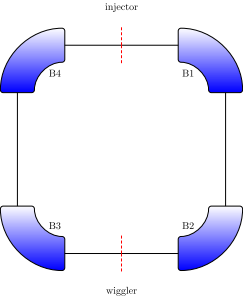

The superconducting design of the 1 GeV ring (see Fig XX) is laid out as four 90-degree sector dipoles, with the injection system located in the middle of a 2 m drift, enclosed by a pair of focusing quadrupole doublets (strengths ~ 50 T/m, 100 T/m) used to begin transport of the diverging electron beam born from the laser wakefield injector.  The wiggler is located in the opposing drift space, and the alternate drift spaces are each 0.5 m, leaving enough space for limited diagnostics.

